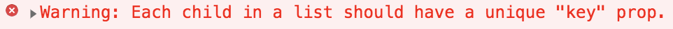
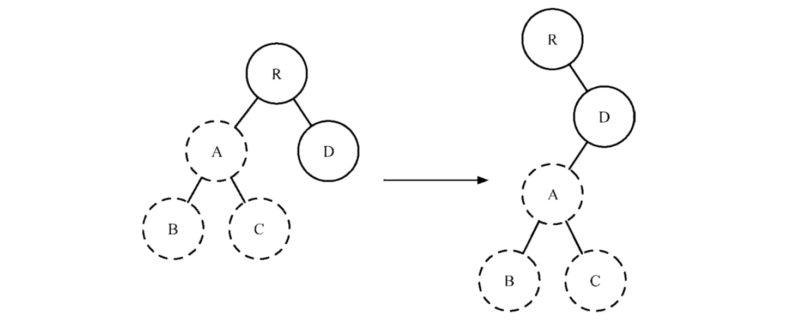
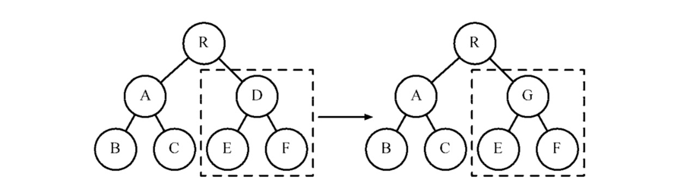
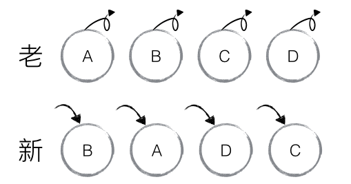
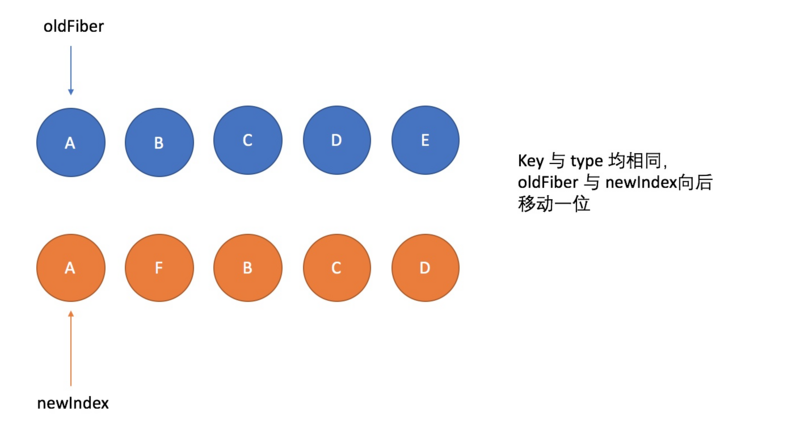

我们在开发过程中，遇到列表等场景时，常常会看到下面的警告提示：`每个child应该要有一个唯一的key`。



> 遇到这种场景，我们可能反手就加上一个索引作为key，那么这个key它是什么？


#### key是什么？
在官方文档中：`key`是在创建元素数组时，需要用到的一个特殊字符串属性。`key`帮助`React`识别出被修改、添加或删除的item。应当给数组内的每个元素都设定key，以使元素具有固定身份标识。

<br/>

#### 解析
开始之前，梳理下react的基础流程:
- Scheduler(调度器) 调度任务的优先级，高优任务优先进入Reconciler
- <b>Reconciler(协调器) 负责找出变化的组件</b>
- Renderer(渲染器) 负责将变化的组件渲染到页面上

顺便了解下`Fiber`:Fiber是一个抽象的节点对象，每个对象可能有子Fiber、相邻Fiber和父Fiber，React使用链表的形式将所有Fiber节点连接，形成链表树。
```javascript
// 指向父级Fiber节点
this.return = null;
// 指向子Fiber节点
this.child = null;
// 指向右边第一个兄弟Fiber节点
this.sibling = null;
```

###### 从Reconciler的Diff出发：
Diff即计算一棵树形结构转换成另一棵树形结构，即使最前沿的算法复杂度也达到O(n^3),这就意味着展示1000个节点，需要执行上亿次比较。
> O(n^3)复杂度如何计算得出？从一棵树转化为另外一棵树,直观的方式是用动态规划，通过这种记忆化搜索减少时间复杂度。由于树是一种递归的数据结构，因此最简单的树的比较算法是递归处理。确切地说，树的最小距离编辑算法的时间复杂度是 O(n^2m(1+logmn)), 我们假设 m 与 n 同阶， 就会变成 O(n^3)。

为了降低算法复杂度，react的diff会预设三个限制：
1. treeDiff:只对同级元素Diff。如果一个DOM节点在前后两次更新中跨越了层级，那么将不会尝试复用。
2. componentDiff:两个不同类型的元素会产生出不同的树。如果元素div变为p，react会销毁div及其子孙节点，并新建p及其子孙节点。
3. elementDiff:通过key来暗示哪些子元素在不同的渲染下能保持稳定。

##### Tree Diff：只对同级元素进行Diff。如果一个DOM节点在前后两次更新中跨越了层级，那么React不会尝试复用他。

<div style="text-align:center;"></div>
两个tree进行对比，右边的新tree发现A节点已经没有了，则会直接销毁A以及下面的子节点B、C；在D节点上面发现多了一个A节点，则会重新创建一个新的A节点以及相应的子节点。  <br/>
具体的操作顺序：create A → create B → creact C → delete A
 <br/>
<b>保证稳定dom结构有利于提升性能，不建议频繁真正的移除或者添加节点</b>
 <br/> <br/>

##### Component Diff：两个不同类型的元素会产生出不同的树。如果元素由div变为p，React会销毁div及其子孙节点，并新建p及其子孙节点
<br/>
<div style="text-align:center;"></div>
当组件D → 组件G时，diff判断为不同类型的组件，虽然它们的结构相似甚至一样，diff仍然不会比较二者结构，会直接销毁D及其子节点，然后新建一个G相关的子tree，这显然会影响性能，官方虽然认定这种情况极少出现，但是开发中的这种现象造成的影响是非常大的。

<b>对于同一类型组件A变化为组件B时，可能Virtual DOM没有任何变化，可以通过使用shouldComponentUpdate、memo优化。应该避免结构相同类型不同的组件</b>


##### Element Diff

> newChildren中每个组件进行比较的是current fiber，同级的Fiber节点是由sibling指针链接形成的单链表，即不支持双指针遍历.即 newChildren[0]与fiber比较，newChildren[1]与fiber.sibling比较。

结合源码一起看看：
react的diff从ReactFiberBeginWork文件的reconcileChildren开始的：
```javascript
    export function reconcileChildren(
      current: Fiber | null,
      workInProgress: Fiber,
      nextChildren: any,
      renderLanes: Lanes,
    ) {
      if (current === null) {
        // 如果首次渲染，current为null，就通过mountChildFibers创建子节点的Fiber实例
        workInProgress.child = mountChildFibers(
          workInProgress,
          null,
          nextChildren,
          renderLanes,
        );
      } else {
        // 如果不是首次渲染就通过reconcileChildFibers去做diff然后更新
        workInProgress.child = reconcileChildFibers(
          workInProgress,
          current.child,
          nextChildren,
          renderLanes,
        );
      }
    }
    
    
    // 可以看到mountChildFibers与reconcileChildFibers调用的ChildReconciler
    export const reconcileChildFibers = ChildReconciler(true);
    export const mountChildFibers = ChildReconciler(false);
```
```javascript
// 根据newChild类型选择不同diff函数处理
function reconcileChildFibers(
  returnFiber: Fiber,
  currentFirstChild: Fiber | null,
  newChild: any,
): Fiber | null {

  const isObject = typeof newChild === 'object' && newChild !== null;

  if (isObject) {
    // object类型，可能是 REACT_ELEMENT_TYPE 或 REACT_PORTAL_TYPE
    switch (newChild.$$typeof) {
      case REACT_ELEMENT_TYPE:
        // 调用 reconcileSingleElement 处理
      // // ...省略其他case
    }
  }

  if (typeof newChild === 'string' || typeof newChild === 'number') {
    // 调用 reconcileSingleTextNode 处理
    // ...省略
  }

  if (isArray(newChild)) {
    // 调用 reconcileChildrenArray 处理
    // ...省略
  }

  // 一些其他情况调用处理函数
  // ...省略

  // 以上都没有命中，删除节点
  return deleteRemainingChildren(returnFiber, currentFirstChild);
}
```
1. newChild类型为object、number、string代表同级只有1个节点
2. newChild类型为array，同级有多个节点
<br/>

##### 分别看下这两种场景：
###### 1.单节点diff(reconcileSingleElement)：
```javascript
function reconcileSingleElement(
  returnFiber: Fiber,
  currentFirstChild: Fiber | null,
  element: ReactElement
): Fiber {
  const key = element.key;
  let child = currentFirstChild;
  // 首先判断是否存在对应DOM节点
  while (child !== null) {
    // 上一次更新存在DOM节点，接下来判断是否可复用
    // 首先比较key是否相同
    if (child.key === key) {
      // key相同，接下来比较type是否相同
      switch (child.tag) {
        // ...省略case
        default: {
          if (child.elementType === element.type) {
            // type相同则表示可以复用
            // 返回复用的fiber
            return existing;
          }
          // type不同则跳出循环
          break;
        }
      }
      // 代码执行到这里代表：key相同但是type不同
      // 将该fiber及其兄弟fiber标记为删除
      deleteRemainingChildren(returnFiber, child);
      break;
    } else {
      // key不同，将该fiber标记为删除
      deleteChild(returnFiber, child);
    }
    child = child.sibling;
  }

  // 创建新Fiber，并返回 ...省略
}
```
从代码可以看出，React通过先判断key是否相同，如果key相同则判断type是否相同，只有都相同时一个DOM节点才能复用。
1. 当child !== null、key相同、type不同时执行deleteRemainingChildren将child及其兄弟fiber都标记删除。
2. 当child !== null且key不同时仅将child标记删除。

##### 真实案例分析
```javascript
    // 当前页面展示
    <ul>
        <li>1</li>
        <li>1</li>
        <li>2</li>
    </ul>
    
    // 需要更新
    <ul>
        <p>1</p>
    </ul>
```
在reconcileSingleElement中遍历之前的三个li，寻找本次需要更新的p是否可以复用之前的3个fiber。
- 当key相同，type不同，表示已经找到本次更新的p对应上次的fiber，但是因为type不同，不能复用。既然唯一的可能性已经不能复用，剩下的则标记删除。
- key不同，只表示当前fiber不能被p复用，后面有可能还能匹配到，所以只标记当前的fiber删除

###### 2.多节点diff(reconcileChildrenArray)：
<div style="text-align:center"></div>
<br/>
A、B、C、D，更新后的新集合中包含节点：B、A、D、C，此时新老集合进行 diff 差异化对比，发现 B != A，则创建并插入 B 至新集合，删除老集合 A；以此类推，创建并插入 A、D 和 C，删除 B、C 和 D。
<br/><br/>
但其中很多都是相同的节点，因为位置发生变化，导致需要繁杂低效的删除、创建操作，其实只要对这些节点进行位置移动即可。针对这一现象，react提出优化策略：允许对同一层级的同组子节点，添加唯一的`key`进行区分。

<div style="text-align:center"></div>

##### 对上述过程解析
```javascript
    // 老的
    ABCD
    // 新的
    BADC
    
    ====第一轮遍历开始===
    B vs A
    key改变，不能复用，跳出遍历
    ====第一轮遍历结束===
    
    ====第二轮遍历开始===
    newchildren = BADC 没用完，不需要执行插入新节点
    oldFiber = ABCD 没用完，不需要执行删除旧节点
    
    将剩余的oldFiber(ABCD)保存为map 
    
    > 继续遍历剩余的newchildren
    
    当前 oldFiber ABCD
    当前 newchildren BADC
    
    key === B 在oldeFiber中存在
    const oldIndex = B.index 
    此时 oldIndex === 1 // oldFiber ABCD 所以B.index == 1
    比较 oldIndex 与 lastPlacedIndex
    oldIndex 1 > lastPlacedIndex 0
    lastPlacedIndex = 1
    B节点位置不变
    
    > 继续遍历剩余的newchildren
    
    当前 oldFiber ACD
    当前 newchildren ADC
    
    key === A 在oldFiber中存在
    const oldIndex = A.index  oldFiber ABCD 所以A.index == 0
    此时 oldeIndex = 0
    oldIndex 0 < lastPlacedIndex 1
    A节点需要向右移动
    
    
    > 继续遍历剩余的newchildren
    
    当前 oldFiber CD
    当前 newchildren DC
    
    key === D 在oldFiber中存在
    const oldeIndex = D.index oldFiber ABCD 所以D.index == 3
    此时 oldeIndex = 3
    oldIndex 3 > lastPlacedIndex 1
    lastPlacedIndex = 3
    D节点位置不变
    
    > 继续遍历剩余的newchildren
    
    当前 oldFiber C
    当前 newchildren C
    
    key === C 在oldFiber中存在
    const oldeIndex = C.index oldFiber ABCD 所以C.index == 2
    此时 oldeIndex = 2
    oldIndex 2 < lastPlacedIndex 3
    C节点需要向右移动
    
    
    ====第二轮遍历结束===
    
    
```
> oldIndex 0 < lastPlacedIndex 1 为true时需要移动，因为lastIndex是不断更新的。表示访问过的节点再集合中最右的位置，若当前访问节点在旧集合中的位置比lastPlacedIndex大，即靠右，说明它不会影响其他元素的位置，因此不用添加到差异队列，不执行移动操作。反之进行移动操作


###### 思考如下过程
<div style="text-align:center"></div>

```javascript
    // 老的
    ABCDE
    // 新的
    AFBCD
    
    ====第一轮遍历开始===
    A vs A
    key不变，能复用，跳出遍历
    此时A对应的oldFiber.A = 0 
    所以 lastPlacedIndex = 0
    
    继续第一轮遍历
    F vs B
    key改变，不能复用，跳出第一轮遍历
    此时 lastPlacedIndex = 0
    ====第一轮遍历结束===
    
    ====第二轮遍历开始===
    newchildren = FBCD 没用完，不需要执行插入新节点
    oldFiber = BCDE 没用完，不需要执行删除旧节点
    
    将剩余的oldFiber(BCDE)保存为map 
    
    > 继续遍历剩余的newchildren
    
    当前 oldFiber BCDE
    当前 newchildren FBCD
    
    key === F 在oldeFiber中不存在 则命中 插入
    lastPlacedIndex = 0
    
    
    > 继续遍历剩余的newchildren
    
    当前 oldFiber BCDE
    当前 newchildren BCD
    
    key === B 在oldFiber中存在
    const oldIndex = B.index  ABCDE 所以B.index == 1
    此时 oldeIndex = 1
    oldIndex 1 > lastPlacedIndex 0
    B节点保持不变
    lastPlacedIndex = 1
    
    
    > 继续遍历剩余的newchildren
    
    当前 oldFiber CDE
    当前 newchildren CD
    
    key === C 在oldFiber中存在
    const oldeIndex = C.index oldFiber ABCDE 所以C.index == 2
    此时 oldeIndex = 2
    oldIndex 2 > lastPlacedIndex 1
    lastPlacedIndex = 2
    C节点位置不变
    
    > 继续遍历剩余的newchildren
    
    当前 oldFiber DE
    当前 newchildren D
    
    key === D 在oldFiber中存在
    const oldeIndex = D.index oldFiber ABCD 所以C.index == 3
    此时 oldeIndex = 3
    oldIndex 3 > lastPlacedIndex 2
    D节点位置不变
    
    > 继续遍历剩余的newchildren
    
    当前 oldFiber E
    当前 newchildren null
    
    删除剩余的节点
    
    ====第二轮遍历结束===
    
    
```

#### React中依据key进行销毁重建or更新的原则：
- key相同，组件有所变化，react会只更新组件对应变化的属性
- key不同，组件会销毁之前的组件，将整个组件重新渲染

1. 索引 (业务场景：虚拟滚动之输入框)
```javascript
    const listArr = [{
      name:"张三",
      age: 18,
      id:'zs'
    },{
      name:"李四",
      age: 19,
      id:'ls'
    },{
      name:"王五",
      age: 44,
      id:'ww'
    },{
      name:"赵六",
      age: 29,
      id:"zl"
    }];
    export default () => {
      const [data, setData] = useState(listArr);
    
      const add = () => {
        setData([
          {
            name:"周一",
            age: 10000,
            id:"zy"
          },
          ...data
        ])
      };
    
      return (
        <div className="App">
            <button onClick={add}>增加</button>
            <ul>
              {
                data.map((v,i)=>{
                  return (
                    <li key={i}>
                      {v.name}:{v.age}
                      <input type="text" />
                    </li>
                })
              }
            </ul>
        </div>
      );
    }
```
demo1可以知道：key为索引时，发现key为0的组件在旧的dom结构中存在，并且组件的位置还是原来的位置，所以直接保留了原组件，但是组件的属性已经发生变更，修改属性渲染。

> 为什么我们平常说索引作为key性能低效？如果是纯展示其实影响不大，但是如果出现动态的场景那就差别很大。
```javascript
<!-- newVDom -->
<ul>
    <li>b</li>  <!-- key==0 -->
    <li>c</li>  <!-- key==1 -->
    <li>d</li>  <!-- key==2 -->
    <li>e</li>  <!-- key==3 -->
</ul>
<!--  oldVDom -->
<ul>
    <li>a</li>  <!-- key==0 -->
    <li>b</li>  <!-- key==1 -->
    <li>c</li>  <!-- key==2 -->
    <li>d</li>  <!-- key==3 -->
    <li>e</li>  <!-- key==4 -->
</ul>
```
| newVDom| oldVDom	|变化|
|  ----  | ---- | ----   |
|key==0	|key==0	|文本改变|
|key==1	|key==1	|文本改变|
|key==2	|key==2	|文本改变|
|key==3	|key==3	|文本改变|
|无	|key==4	|删除节点|

react只有被改变了的元素才会被重新渲染,diff将上面的所有比对的差异放入一个补丁包中，再将补丁包应用到真实DOM上。


2. 重复的key 
```javascript
    const listArr = [{
      name:"张三",
      age: 18,
      id:'A'
    },{
      name:"李四",
      age: 19,
      id:'A'
    }];
```

key重复时是怎么样？？？
```javascript
    // 老的
    AA
    // 新的
    CAA
    
    ====第一轮遍历开始===
    C vs A
    key改变，不能复用，跳出遍历
    ====第一轮遍历结束===
    
    const existingChildren = mapRemainingChildren(returnFiber, oldFiber);
    oldFiber = AA -> A(index=1)
    
    ====第二轮遍历开始===
    newchildren = CAA 没用完，不需要执行插入新节点
    oldFiber = A 没用完，不需要执行删除旧节点
    
    将剩余的oldFiber(A)保存为map 
    
     > 继续遍历剩余的newchildren
    
    当前 oldFiber A
    当前 newchildren CAA
    
    在oldeFiber中不存在 则命中 插入
    lastPlacedIndex = 0
    
     > 继续遍历剩余的newchildren
     
    当前 oldFiber A
    当前 newchildren AA
    
    在oldeFiber中存在 oldIndex = A.index = 1
    此时 oldeIndex = 1
    oldIndex 1 > lastPlacedIndex 0
    A节点保持不变
    
     > 继续遍历剩余的newchildren
    当前 oldFiber null
    当前 newchildren A
    
    在oldeFiber中不存在，则命中 插入
   
    ====第二轮遍历结束===
    
    
```
<br/>

#### 业务项目中 巧用key的场景
1. Tntd-Layout 应用切换
    ```javascript
        <Layout
    		key={get(currentApp, "key")}
		/>
    ```
2. Iframe goBack
    ```javascript
        <iframe
        	src={pathUrl}
        	key={pathUrl}
        />
    ```
 
<br/>
    
> 总结： key的真实目的是为了标识在前后两次渲染中元素的对应关系，防止发生不必要的更新操作。