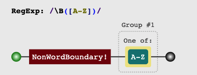
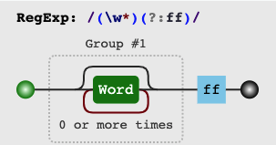
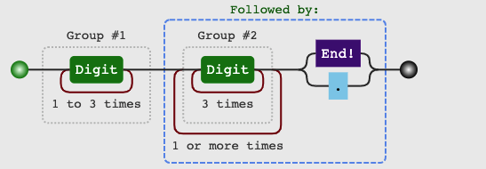
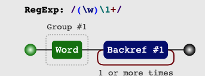

正则表达式

> 看到正则习惯性地逃避。平常在遇到手机号、邮箱、身份证号等场景，选择直接搜索现成的正则表达式。但其实正则只是类似「加减乘除」的各种表达式而已。如果平常觉得难以阅读，先推荐一个网站：https://jex.im/regulex。


#### 发现正则之美
将字符串 <code>LetUsToStudyRegexpTogether.</code>转换成  <code>Let us to study regexp together.</code> 

可能最开始看到这个题的时候，第一想法是字符串解析如下：
```javascript
function transfer(str){
    return Array.prototype.map.call(str,(v,i)=>{
        if(v.charCodeAt(0)<90 && i > 0){
            v = ` ${v.toLowerCase()}`
        }
        return v
    }).join('')
}
console.log(transfer('LetUsToStudyRegexpTogether'))
```
那看下用正则的方式：
```javascript
function transfer(str){
    return str.replace(/\B([A-Z])/g,(i)=>{
        return ` ${i.toLowerCase()}`;       
    })
}
console.log(transfer('LetUsToStudyRegexpTogether'))
```

正则明显简练很多，我们把 `/\B([A-Z])/g` 放入上述的网站中可以看到它的含义：<b>不在边界的大写字符</b>



<br/>
但是`^\B[^\w].*?+$`这是具体是什么含义？
<br/>

#### 基础

> 在开始之前，先了解下转义字符即「改变其本来的含义」。
> + 本身为特殊字符，譬如`\`、`*`在其前加转义元字符`\`变成非特殊字符。例如：将手机号中的<code>*</code>替换成0，`"159********".replace(/\*/g,'0')`。
> + 本身为非特殊字符，譬如`n`,`s`在其前面加转义元字符`\`变为特殊字符。

-----
##### 匹配字符
###### 1. 特殊字符
| 正则表达式  |     描述      |  联想技巧  |
|----------|:-----------------:|------------------:|
| \d |  数字[0-9]   |  digit |
| \D |  除了[0-9] |   not digit |
| \w |  [A-Za-z0-9] |   word |
| \W | 除了[A-Za-z0-9] |  not word |
| \s |  任何空白字符，包括空格、制表符\t\v、换页符\f、换行符\n、回车符\r|   space |
| \S | 非空白字符  |  not space |
| \f |  换页符 | form feed     |
| \n |  换行符   |  newline |
| \r |  回车符 |  return character |
| \t | 制表符，即按下键盘Tab将占8列 |   tab |
| \v | 垂直制表符，让\v后面的字符从下一行开始输出，<br/>且开始列数为前一个字符所在列后面一列 |  vertical tab |


###### 2. 基本元字符
| 正则表达式  |     描述      |  联想技巧  |
|----------|:-----------------:|------------------:|
| . |  除了换行符之外的任何单字符 | 句号，除了句子结束符     |
| [] | [1,2,3]匹配字符集合中的一个字符，类似.，这些字符都表示其本身  |  数组集合 |
| - | 定义区间 | 例如[0-9] |
| [^regex] 和 ! | 非。其中`[^regex]`为对集合内取非 | 只有在`[]`里面`^`才代表非的含义 |
|  \|		|  或   |  js中或为 \|\|  |


----------
##### 数量元字符
| 正则表达式  |     描述      |  联想技巧  |
|----------|:-----------------:|------------------:|
| ? | 0 或 1 | 询问有无 |
| * |  大于等于0   |  适用于模糊匹配，不关注是否有无 |
| + |  大于等于1 |   +1 |
| {min,max} |  最少min，最多max |   范围区间 |

贪婪、非贪婪。在数量元字符后面添加?表示为非贪婪：
```javascript
const str = 'hi，my friend';
// 贪婪
console.log(str.match(/\w{2,3}/g)) //  ["hi", "my", "fri", "end"]
// 非贪婪
console.log(str.match(/\w{2,3}?/g))  // ["hi", "my", "fr", "ie", "nd"]
```


----------
##### 位置元字符
| 正则表达式  |     描述      |  备注  |
|----------|:-----------------:|:------------------|
| \b | 边界 | boundary |
| \B |  非边界   |  大写的都是取反 |
| ^ |  单独使用表达式的开始 |    |
| \$ |  结尾 |   
|(?:)|本身不被消费，避免内存浪费| `'zfzff'.replace(/(\w*)(?:ff)/,'$1,$2')` zfz,$2|
|(?=)|匹配表达式 前面的位置| 匹配bc前边的位置即a： 'abc'.replace(/(.)(?=bc)/g,'$1#') = "a#bc"|
|(?\!)|匹配不是表达式 前面的位置|匹配不是bc前面(故a被排除)：即b、c： 'abc'.replace(/(.)(?!bc)/g,'$1#') = "ab#c#" |
|(?<=)|匹配表达式后面的位置| 匹配bc后面的位置：'abc'.replace(/(.)(?<=bc)/g,'$1#') = abc# |
|(?<\!)|匹配不是表达式后面的位置| 匹配不是bc后面的位置：'abc'.replace(/(.)(?<!bc)/g,'$1#') a#b#c  |


----------
##### 标志字符
| 正则表达式  |     描述      |  联想技巧  |
|----------|:-----------------:|------------------:|
| m | 多行 |   multiple |
| i |  忽略大小 |   ignore|
| g |  全局,会替换多次 |   global |


-------
##### 进阶「子比表达式」
| 正则表达式  |     描述      |  实例  |
|:----------|:-----------------|:------------------|
| \$0,\$1 | \$n表示引用第n个子表达式 |<code>"0571-8219-0000".replace(/(\d{4})(-)(\d{4})(-)(\d{4})/,"(\$1)\$2\$3\$5")</code><br/> 输出 `(0571)-82190000`|
|\0,\1,\2 |  引用第n个子表达式，0表示整个 |<code>"jin can can".replace(/\s+(\w+)\s+\1/g,'$1')</code><br/>这里的\1表示也能用第一个字表达式即 (\w+) <br/> 输出 `jin can` |


#### 结合实际解析

- 千分位，将 123456789.00 转换成 123,456,789.00
	```javascript
	function transfer(str){
        return str.replace(/(\d{1,3})(?=(\d{3})+(?:$|\.))/g, "$1,")
	}
	console.log(transfer('12345678.00'))
	```
	分析下匹配的过程：
	
	<br/>
	```javascript
	// 第一部分
	(\d{1,3})：匹配数字1-3次
	
	// 第二部分
	?=： 零宽断言，表达式前面的位置 联想一下 `'abc'.replace(/(.)(?=bc)/g,'$1#') = "a#bc"`
	(\d{3})+：三个数字一组，1到多次
	(?:$|\.)：结束符或者小数点
	整合(?=(\d{3})+ (?:$|\.)：匹配到结尾或小数点或有3或者3的倍数个数的元素的表达式

	// 第三部分
	g：替换多次，不加只会替换一次

	整个过程比如，第一部分1，后面是2345678是7位数，不是3的倍数不符合，继续往后(从上次匹配完的地方继续开始),12,后面是345678是三的倍数，满足则替换成它本身加个","
	```
- 222333444555变成2345

	```javascript
	function transfer(str){
		return str.replace(/(\w)\1+/g, "$1")  
		// \1表示引用第一个表达式，这里+表示一次以上的引用表达式1
	}
	console.log(transfer('222333444555'))
	```
	


####  正则对象的方法(番外)

- test： 接受一个字符串参数，如果正则表达式与指定的字符串返回匹配，返回true，否则false。这里test在全局匹配的时候有个坑。详见：[https://www.jianshu.com/p/42572ec84d92]

- exec：返回匹配结果的数组。当 exec() 找到了与表达式相匹配的文本时，在匹配后，它将把正则实例的 lastIndex 属性设置为匹配文本的最后一个字符的下一个位置。


####  支持正则的String对象方法(番外)
- search：如果参数不是正则隐式转换成正则，返回匹配到子串的起始位置
- match：返回匹配结果的数组，包含g匹配多次，不包含指匹配1次
- replace：(regex|string,string)，第一个要被替换的规则可以是正则或字符串，第二个是替换成的文本
- split：
	```javascript
	var myString = "age 18 birthday 20"
	var splits = myString.split(/\d+/); 返回一个数组
	```
