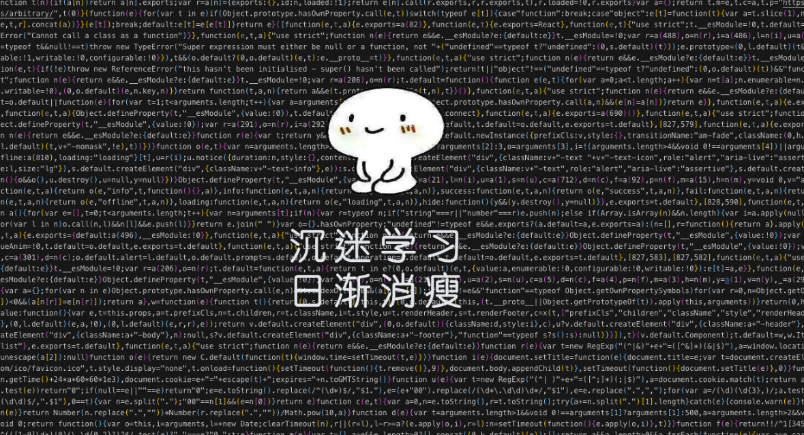

#### 没事写写文章，喜欢的话请点star

#### 基础篇
1. [《RegExp》](./RegExp.md "学习RegExp")

 

-------

 

#### 源码
1. [《Redux源码解析》](./Redux.md "学习RegExp")

2. [《React之Diff》](./ReactDiff.md "学习RegExp")

 

-------

 

#### 基础算法
