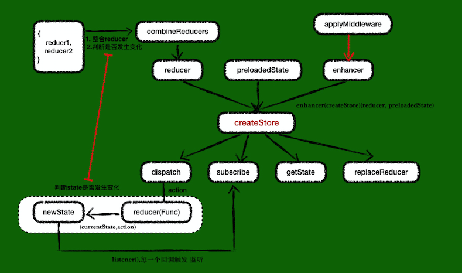

Redux

> redux我们会用它做react的数据管理，在开始源码阅读之前，先了解下redux内部大致的内容




从图中我们大致了解：redux核心方法createStore 接受三个参数 reducer,  preloadedState,  enhancer，经过一些处理生成一些常用的api，如 dispatch,  subscribe,  getState,  replaceReducer。

<br/>

### 来个常见的使用场景：


```javascript

//一个基础的redux使用方式
const order = (state,action) => {
    switch (action.type) {
        case xxx: return Object.assign( {}, state, { otherInfo: { name: 'abc' } });
    }
};

const reducers = combineReducers({
  order,
});

const store = (history) => { 
    let middlewares = [ thunk ];
    // 结合上图看createStore的入参
    return createStore(reducers, applyMiddleware(...middlewares)); 
};

```

### 源码解析
> createStore 着手
```javascript
export default function createStore(reducer, preloadedState, enhancer) {
    ......
    return {
        dispatch,
        subscribe,
        getState,
        replaceReducer,
        [$$observable]: observable
    }
}
```

- 参数一：reducer

从实例中， reducer = combineReducers({ sign, order, })。
combineReducers 方法定义在 combineReducers.js

核心代码如下：
```javascript
export default function combineReducers(reducers) {
    // 第一部分 整合多个reducer，因为createStore只能接受一个reducer
    // 检查 reducer的正确性 必须是 function
    const reducerKeys = Object.keys(reducers)
    const finalReducers = {}
    for (let i = 0; i < reducerKeys.length; i++) {
        const key = reducerKeys[i]
        ......//测试环境输出reducer不合理日志
        if (typeof reducers[key] === 'function') {
            finalReducers[key] = reducers[key]
        }
    }
    const finalReducerKeys = Object.keys(finalReducers)
    ......
    // 第二部分 比较state是否发生变化
    return function combination(state = {}, action) {
        ......  
        // 标志位 state是否发生变化
        let hasChanged = false
        // 变化后新的值
        const nextState = {}
        // 遍历每一个reducer
        for (let i = 0; i < finalReducerKeys.length; i++) {
            const key = finalReducerKeys[i]
            const reducer = finalReducers[key]
            const previousStateForKey = state[key] // 旧的值
            const nextStateForKey = reducer(previousStateForKey, action) // 新的值
            // 如果没有返回则报错
            if (typeof nextStateForKey === 'undefined') {
                const errorMessage = getUndefinedStateErrorMessage(key, action)
                throw new Error(errorMessage)
            }
            nextState[key] = nextStateForKey
            hasChanged = hasChanged || nextStateForKey !== previousStateForKey 
        }
        return hasChanged ? nextState : state
    }
}
```
#### 重点！！！「为什么不能修改state本身？」：
```javascript
//实例：
reducer.order = (state,action) => { 
    switch (action.type) {  
        // 这里为什么要拷贝一份 而不能是 
        // case xxx: return Object.assign( state, { otherInfo: { name: 'abc' } } );
        case xxx: return Object.assign( {}, state, { otherInfo: { name: 'abc' } });
    }
}

// 源码中写道：

// 旧的值
const previousStateForKey = state[key] 

// 新的值  previousStateForKey 即 reducer.order 的实参
const nextStateForKey = reducer(previousStateForKey, action) 

nextStateForKey !== previousStateForKey

// 如果直接`return Object.assign( state, { otherInfo: { name: 'abc' } } );` 即修改了previousStateForKey，虽然有一层Object.assign浅拷贝，但是对于多层的则会出现问题。 后续的 `hasChanged` 拿不到正确的值。。
```
总结：

    1. 将所有`reducer`是`function`的整合到`finalReducers`。
    2. 在dispatch一个action的时候遍历所有reducer，拿到每一个新的state，然后进行新旧比较

<br/>

- preloadedState(可选参数初始化状态)


- enhancer
```javascript
// 传了多个enhancers将他们组合成一个函数
if (
    (typeof preloadedState === 'function' && typeof enhancer === 'function') ||
    (typeof enhancer === 'function' && typeof arguments[3] === 'function')
) {
    throw new Error(
    'It looks like you are passing several store enhancers to ' +
    'createStore(). This is not supported. Instead, compose them ' +
    'together to a single function.')
}
// 如果preloadedState是个方法enhancer为undefined则将preloadedState赋值给enhancer
if (typeof preloadedState === 'function' && typeof enhancer === 'undefined') {
    enhancer = preloadedState
    preloadedState = undefined
}
if (typeof enhancer !== 'undefined') {
    if (typeof enhancer !== 'function') {
        throw new Error('Expected the enhancer to be a function.')
    }
    return enhancer(createStore)(reducer, preloadedState) 
}
```

```javascript
// 将上面的demo中间件模块稍微拓展一下
export default function thunkMiddleware({ dispatch, getState }) {
  return next => action =>
    typeof action === 'function' ? action(dispatch, getState) : next(action);
}
const middlewares = [thunkMiddleware]
createStore(reducers, applyMiddleware(...middlewares))

// 结合上述实例
// 即enhancer =  applyMiddleware(...middlewares) 
// enhancer(createStore)(reducer, preloadedState) = applyMiddleware(...middlewares)(createStore)(reducer, preloadedState)
// applyMiddleware，看下applyMiddleware.js源码 如下

 export default function applyMiddleware(...middlewares) { // 中间件middlewares
  return createStore => (...args) => {
    const store = createStore(...args) // 创建一个store
    // 自定义dispatch函数，在构造middleware的时候，不允许调用dispatch
    let dispatch = () => {
      throw new Error(
        'Dispatching while constructing your middleware is not allowed. ' +
          'Other middleware would not be applied to this dispatch.'
      )
    }
    const middlewareAPI = {
      getState: store.getState,
      dispatch: (...args) => dispatch(...args)
    }
    // 传入getState/dispatch到middleware中 生成 next => action => {} 
    const chain = middlewares.map(middleware => middleware(middlewareAPI)) 
    // 自定义的dispatch更新为多个middleware的组合函数；
    // 传入store原本dispatch函数给组合函数（会在最后一个middle中作为next函数）形成一个链式
    dispatch = compose(...chain)(store.dispatch) 

    // 返回store，dispatch已经是middleware的组合函数
    return {
      ...store,
      dispatch
    }
  }
}


// compose 源码
// 从右到左组合单参数函数。最右边的函数可以接受多个参数，例如，compose(f，g，h)(...args）=>f( g( h(...args ) ) )
export default function compose(...funcs) {
    if (funcs.length === 0) {
        return arg => arg
    }

    if (funcs.length === 1) {
        return funcs[0]
    }

    // reduce方法可以得出 a(累加器), b(当前值) 返回a(b(...args))
    // 结合applyMiddleware中
    // a = next => action => {}， next = b(...args)就是下一个middleware的 ation => {} 函数。
    // a中做了自定义的操作，会调用b，b调用c···最后一个调用store.dispatch。
    return funcs.reduce( (a, b) => (...args) => a( b(...args) ) )
}
```

------
> 出参（getState， subscribe，dispatch，replaceReducer）

1. getState 获取store中的state，因为是只读的，所以得通过这个方法去获取
```javascript
function getState() {
    // 如果正在dispatch，说明state正在计算中，现在的state是旧的为了确保用户能获取最新的
    // state，所以需要加一个判断，如果正在dispatch则抛出错误，反之则返回现在的state
    if (isDispatching) {
      throw new Error(
        'You may not call store.getState() while the reducer is executing. ' +
          'The reducer has already received the state as an argument. ' +
          'Pass it down from the top reducer instead of reading it from the store.'
      )
    }
    return currentState
}

```


2. subscribe 监听state变化
```javascript
// 订阅store变化，这里可能有个疑惑 redux都没使用这个监听state变化的函数 直接利用reducer返回一个新的state 就组件就发生变化
// 这是因为一般项目中react-redux帮我们做了这件事。不需要自己去subscribe全局state的变化，以及去getState https://github.com/reduxjs/react-redux/blob/master/src/utils/Subscription.js#L69 。
function subscribe(listener) {
    // listener 是state变化的回调所以必须是个方法
    if (typeof listener !== 'function') {
      throw new Error('Expected the listener to be a function.')
    }
    // 如果正在dispatch则报错，state在变化的时候需要保证监听器也是新的
    if (isDispatching) {
      throw new Error(
        'You may not call store.subscribe() while the reducer is executing. ' +
          'If you would like to be notified after the store has been updated, subscribe from a ' +
          'component and invoke store.getState() in the callback to access the latest state. ' +
          'See https://redux.js.org/api-reference/store#subscribe(listener) for more details.'
      )
    }
    let isSubscribed = true // 防止重复取消监听
    // 在每次“dispatch（）”调用之前，对订阅进行快照。如果在调用侦听器时订阅或取消订阅，则对当前正在进行的“dispatch（）”没有任何影响
    ensureCanMutateNextListeners() // 生成一个简单的当前侦听器副本
    nextListeners.push(listener)
    return function unsubscribe() {
      if (!isSubscribed) {
        return
      }
      if (isDispatching) {
        throw new Error(
          'You may not unsubscribe from a store listener while the reducer is executing.... '
        )
      }
      isSubscribed = false
      ensureCanMutateNextListeners()
      const index = nextListeners.indexOf(listener)
      nextListeners.splice(index, 1)
      currentListeners = null
    }
  }
```

3. dispatch 通过dispatch发送action给reducer，reducer根据action和currentState，计算新的state
```javascript
function dispatch(action) {
    // 简单的例子
    // dispatch({
    //    type: 'CARINLIB_INIT'
    // })
    if (!isPlainObject(action)) {
      throw new Error(
        'Actions must be plain objects. ' +
          'Use custom middleware for async actions.'
      )
    }

    if (typeof action.type === 'undefined') {
      throw new Error(
        'Actions may not have an undefined "type" property. ' +
          'Have you misspelled a constant?'
      )
    }

    if (isDispatching) {
      throw new Error('Reducers may not dispatch actions.')
    }

    try {
      isDispatching = true
      currentState = currentReducer(currentState, action) // 通过reducer计算新的state
    } finally {
      isDispatching = false
    }

    const listeners = (currentListeners = nextListeners)
    for (let i = 0; i < listeners.length; i++) {
      const listener = listeners[i]  
      listener() // 执行回调
    }

    return action
  }
```

#### 有不足之处望指正🙏！
