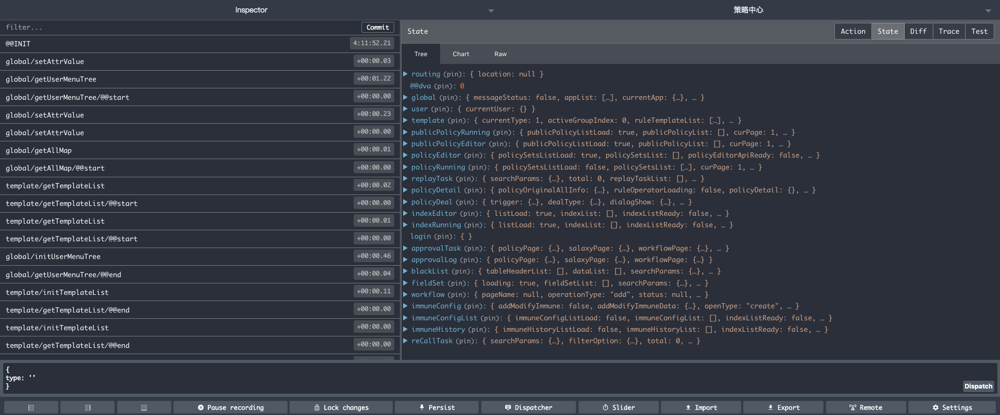
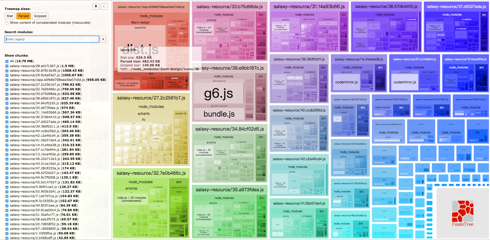
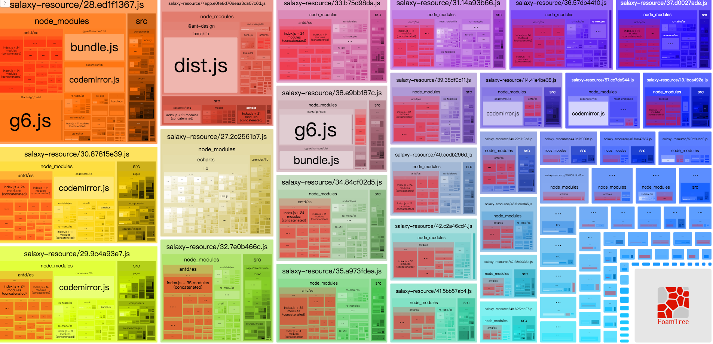
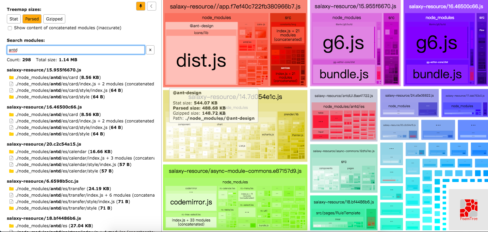
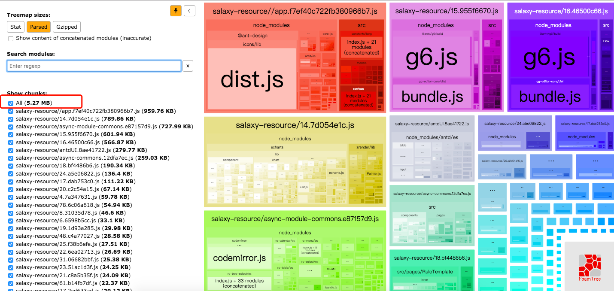

> webpack处理应用程序时，递归地构建一个依赖关系图，其中包含应用程序所需的每个模块，然后将所有这些模块打包成1个或多个bundle

#### 🔥核心概念
- 入口：构建内部依赖图的开始
- 输出：向硬盘写入编译文件。告诉webpack在哪里输出它所创建地bundles
- loader：转换某些类型的模块。将所有类型地文件转换为webpack能够处理地有效模块。
  - test：用于标识应该被对应地loader进行转换地某个或某些文件。
  - use：进行转换时应该使用哪个loader。
  - module.rules中的即：当你遇到符合test路径时，在对它打包之前，先使用loader转换一下
- 插件：从打包优化和压缩，一直到重新定义环境中的变量，可以用来处理各种各样的任务


#### ⛽️webpack的基本构建流程


Compiler：包含当前运行Webpack的配置，包括entry、output、loaders等配置，这个对象在启动Webpack时被序列化，而且是全局唯一的。Plugin可以通过该对象获取到Webpack的配置信息进行处理。

Compilation：对象代表某个版本的资源对应的编译进程。当使用Webpack的development中间件时，每次检测到项目文件有改动就会创建一个compilation，进而能够针对改动生产全新的编译文件。compilation对象包含当前模块资源、待编译文件、有改动的文件和监听依赖的所有信息。

> Compiler 和 Compilation 的区别在于：Compiler 代表了整个 Webpack 从启动到关闭的生命周期，而 Compilation 只是代表了一次新的编译


综上通俗的描述：
1. 初始化配置文件
2. 生成compiler对象,负责文件监听和启动编译
3. 初始化插件，让插件可以监听后续的所有事件节点
4. run阶段 触发compile，启动一次新的编译。
5. compilation对象组织整个编译过程进行编译。从 Entry 发出，针对每个 Module 串行调用对应的 Loader 去翻译文件内容，再找到该 Module 依赖的 Module，递归地进行编译处理。
6. seal逐次对每个Moudle和chunk进行整理，生成编译后的源码。
7. 编译完成写入到磁盘

<br/>

### webpack的runtime和manifest 管理所有模块的交互

#### ⭐️Runtime
在浏览器运行时，webpack用来连接模块化的应用程序的所有代码，runtime包含：在模块交互时，连接模块所需的加载和解析逻辑。包括浏览器中已加载模块的连接，以及懒加载模块的执行逻辑
<br/>

#### ⭐️Manifest
当编译器开始执行、解析和映射应用程序时，会保留所有模块的详细要点。这个数据集合称为“Manifest”,当完成打包并发送到浏览器时，会在运行时通过Manifest来解析和加载模块。无论选择import或require语句，现在都转换为__webpack_require_方法，此方法指向模块标识符，通过manifest中的数据，runtime将能够查询模块标识符，检索出背后对应的模块


<br/>

#### 以上是对整个webpack工作过程的一个大概描述,那么结合当前的项目，我们还可以做些什么？

1. redux 无法在浏览器中调试。对于一些数据交互类的调试或者bug定位非常不便。
   
   解决方案：将dva从webpack.dll配置文件中删除，重新build:dll即可。那么dva应该如何处理？请看下一个话题！

2. optimization.splitChunks 例如业务逻辑未提取
   
   
   
   提取原则：
   - 基础类库：react，react-redux，react-router
   - UI库：antd，antd-icons
   - 公共组件库：自定义的公共组件
   - 低频组件
   - 业务代码
  
   ```javascript
      splitChunks: {
        cacheGroups: {
            antdUI: {
                name: "antdUI",
                priority: 100,
                test: /(antd)/,
                minChunks: 3,
                reuseExistingChunk: true
            },
            asyncModuleCommons: { 
                chunks: "async",
                minChunks: 3,
                test: /(node_modules)/,
                name: "async-module-commons",
                priority: 90,
                reuseExistingChunk: true
            },
            asyncCommons: { 
                chunks: "async",
                minChunks: 3,
                test: /(src)/,
                name: "async-commons",
                priority: 80,
                reuseExistingChunk: true
            }
        }
    }
   ```
   
   
   
3. runtimeChunk
   1. 当更改app的时候runtime与组件不会发生变化。main的hash发生变化
   2. 当组件改变是main的hash不变化，组件和runtime发生变化
   
4. moment 语言包
   ```new webpack.ContextReplacementPlugin(/moment[\/\\]locale$/, /zh-en|en-us/)```

5. build太慢。
   多线程：happypack、webpack-parallel-uglify-plugin 试了下没看到显著的效果
   
   