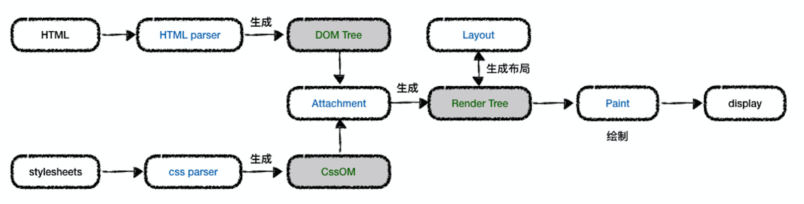

[《借鉴于MDN》](https://cloud.tencent.com/developer/article/1372962 "MDN")

> 先了解下网页是怎么生成的？如下图：

可见有5个步骤：
1. 生成domTree 和 cssOMTree
2. 结合dom/cssOM生成渲染树，包含网页所需的节点。
3. 回流生成布局，将渲染树进行平面合成。进行layout计算布局信息，包括节点的大小和位置
4. 重绘：根据渲染树和回流的具体几何信息，将每个节点转换为屏幕上的实际像素
5. 展示页面：将像素发送给GPU，GPU将多个合成层合并为同一个，并展示在页面中

> attachment(底层c++的一个方法)：webkit中为每个DOM Tree结合样式创建渲染树的过程

 

------

 

### 构建渲染树，浏览器主要做了以下几件事：

- 从DOM树的根节点开始遍历每个「可见节点」
- 对于每个可见的节点，找到CSSDOM树中对应的规则，并应用他们
- 根据每个可见节点以及其对应的样式，组合生成渲染树

可见节点？什么是可见？什么是不可见？
- 不会渲染输出的节点，如script、meta、link
- 通过css隐藏的节点，利用visibility和opacity隐藏的节点还是会显示在渲染树上。只有display:none的节点才不会显示在渲染树上。

#### 插个小知识点：
> 很多时候经常会问：display:none 、 visibility 、 opacity 三者有什么区别？

| 描述  |     opacity      |  visibility:hidden  | display:none  |
|----------|:-----------------:|------------------:|-----------------:|
| <b>是否占据页面空间</b>  |     yes      |  yes  | no  |
| 子元素设置该属性其他值是否可以继续显示  |     no      |  yes  | no  |
| 自身绑定的事件是否能继续触发  |     yes      |  no  | no  |
| 是否影响遮挡住的元素触发事件  |     影响      |  不影响  | 不影响  |
| <b>属性值改变是否发生回流</b> |  no   |  no  | yes  |
| <b>属性值改变是否发生重绘</b>  |  不一定 |  yes  | yes  |
| 该属性是否支持transition  |     yes      |  yes  | no  |

 

### 布局
> 渲染树只是包含了用于渲染页面的节点，它没有位置和大小，计算这些值称为「布局」。
HTML基于流的布局模式，意味着大多数事件可以一次性计算几何图形。坐标相对于根节点，使用左上原点坐标。
布局是一个递归过程，它从根节点开始，对应HTML文档的`<html>`元素。布局以递归方式继续通过整个节点层次结构，为每个需要它的渲染器计算几何信息即给每个节点在屏幕上标示出确切的坐标。
 

### 重绘
> 通过渲染树以及布局，了解可见节点的样式以及几何信息后，我们可以将每个节点转换为屏幕上的实际像素，这个阶段叫做「重绘」

 

### 为什么经常说回流和重绘最耗时、成本最大？
> 回流会导致渲染树需要重新计算。一个元素的重排通常会带来一系列的反应，甚至触发整个文档的重排和重绘，性能代价是高昂的。如果回流频率很高，CPU使用率会大大增加。

 

### 回流和重绘的关系
> <b>回流一定发生重绘</b> 
<b>重绘不一定回流</b>

 

### 什么场景触发回流？

- 添加、删除、移动可见的元素。浏览器引擎布局的过程类似于树的前序遍历，是一个从上到下，从左到右的过程。通常情况，当前元素不会影响其前面已经遍历过的元素，所以如果在body前插入一个元素，会导致整个文档重新渲染。
- 当元素尺寸变动（边距、填充、边框、高度、宽度等）：元素的几何属性变化时，渲染树中的相关节点就会失效，浏览器会根据DOM元素的变化重新构建渲染数中失效的节点
- 写操作之后，如果有下面这些属性的读操作，都会引发浏览器立即重新渲染.因为这些属性和方法都需要返回最新的布局信息。因此浏览器不得不清空队列，触发回流重绘来返回正确的值。
    - offsetTop/offsetLeft/offsetWidth/offsetHeight
    - scrollTop/scrollLeft/scrollWidth/scrollHeight
    - clientTop/clientLeft/clientWidth/clientHeight
    - getComputedStyle()
- 内容改变，比如文本改变或者图片大小改变而引起的计算值宽度和高度改变
- 浏览器窗口尺寸改变，比如resize
- 初次渲染页面时

 

### 如何减少回流、重绘
回流和重绘会不断被触发，而且他们非常的消耗资源例如cpu，导致网页性能低下。所以如果要提升网页性能，就要尽量少触发回流和重绘。
 
js中：
- 避免逐项更改样式。最好一次性更改style属性，或者将样式列表定义为class并一次性更改class属性
- 昂贵的dom操作，批量修改dom 脱离文档流
    - 将元素设置为display:none，改完再显示
    - clone到脱离文档流的节点，改完替换原来的
    - 使用文档片段在当前DOM之外创建一个子树，改完再拷贝回来
- 避免读写交叉。不然会不断的去拿最新的布局信息

css中：
- 尽可能在DOM树的最末端改变class
- 避免设置多层内联样式
- 复杂动画，绝对定位脱离文档流absolute或fixed
- css3硬件加速。使用css3硬件加速，可以让transform、opacity、filters这些动画不会引起回流重绘 。但是对于动画的其它属性，比如background-color这些，还是会引起回流重绘的，不过它还是可以提升这些动画的性能。
- 只在必要的时候，才将元素的display属性为可见，因为不可见的元素不影响重排和重绘。另外，visibility : hidden 的元素只对重排有影响，不影响重绘
- 避免使用table布局
- 避免使用CSS的JavaScript表达式

 

