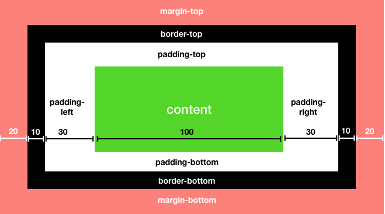
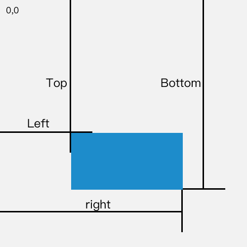
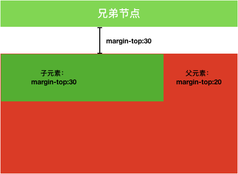

> 什么是盒子模型？顾名思义是一个类似盒子的模型，有：边距(margin)、边框(broder)、填充(padding)、实际内容(content)


<br/>
<br/>

##### 盒子模型的类型
盒子模型有两种标准，一种是标准模型，一种是IE模型。

```javascript
    // 在css中我们可以通过设置`box-sizing`来设置所需的模型类型
    box-sizing: content-box; // 标准模型
    box-sizing: border-box;  // IE模型
```

下面我们看下两种模型之间的区别：
- 标准模型（<b>宽度和高度即为content区域本身的宽度和高度</b>）：
    上图在标准模型中宽度即为：100，同理高度


- IE模型（<b>content+padding+border</b>）：
    上图在IE模型中宽度即为：180，同理高度


<br/>
##### js如何设置获取盒模型对应的宽和高
1. dom.style.width/height
    只能获取到dom元素的内联样式
2. dom.currentStyle.width/height
    在页面渲染完之后获取元素的样式，无关内联外联
3. window.getComputedStyle(dom).width/height
    比第二种的兼容性要好
4. dom.getBoundingClientRect().width/height
   拿到的宽度高度为元素的offsetWidth/offsetHeight      
   除了width/height之外的属性(例如left、top、right、bottom)都是相对于视口的左上角位置而言。
   
    
5. dom.offsetWidth/offsetHeight
   offsetWidth: 水平方向 width + 左右padding + 左右border-width
   offsetHeight: 垂直方向 height + 上下padding + 上下border-width
6. dom.clientWidth/dom.clientHeight
    clientWidth: 水平方向 width + 左右padding
    clientHeight: 垂直方向 height + 上下padding

> 附加：
    offsetTop：获取当前元素到定位父节点的top方向的距离
    offsetLeft：获取当前元素到定位父节点的left方向的距离<br/>
    scrollWidth：元素内容真实的宽度，内容不超出盒子高度时为盒子的clientWidth
    scrollHeight：元素内容真实的高度，内容不超出盒子高度时为盒子的clientHeight<br/>
    document.documentElement.clientWidth：浏览器窗口可视区宽度（不包括浏览器控制台、菜单栏、工具栏、滚动条）
    document.documentElement.clientHeight：浏览器窗口可视区高度（不包括浏览器控制台、菜单栏、工具栏、滚动条）<br/>
    document.documentElement.offsetHeight：获取整个文档的高度（包含body的margin）
    document.body.offsetHeight：获取整个文档的高度（不包含body的margin）<br/>
    document.documentElement.scrollTop：返回文档的滚动top方向的距离（当窗口发生滚动时值改变）
    document.documentElement.scrollLeft：返回文档的滚动left方向的距离（当窗口发生滚动时值改变）


<br/>
##### BFC(Block Formatting Context 边距重叠解决方案)
场景再现：
看下图「边距重叠」子元素的top距离与父元素的top距离重叠取最大值：


```javascript
<style>
    *{
        margin:0;
        padding:0;
    }
    .sibling{
        background: #0f0
    }
    .parent{
        background-color: #f00;
        margin-top:20px;
    }
    .child{
        background-color: #00f;
        margin-top:30px;
    }
</style>

<div class="sibling">兄弟节点1</div>
<div class="parent">
    <div class="child">
        子
    </div>
    兄弟节点2，父
</div>
```
> 什么是BFC？直接翻译的话表示为“块级格式化上下文”，是一个独立的渲染区域，只有Block-leve box参与，它规定了内部的Block-level Box如何布局，并且与这个区域外部毫不相干。


BFC = block-level box + Formatting Context


BOX即盒子模型：
- block-level box即块级元素
- inline-level box即行内元素


Formatting Context：页面重的一个渲染区域决定了其子元素将如何定位，以及和其他元素的关系、相互作用。


BFC如何生成：
- 根元素
- float的值不为none（脱离文档流）
- overflow不为visible
- display为inline-block,table-cell,table-caption,flex,inine-flex
- positon为absolute或fixed

BFC的原理：
1. 内部的box会在垂直方向一个接一个放置
2. 垂直方向上的距离由margin决定。同一个bfc的相邻box的margin会重叠
3. 每个元素的左外边距与包含块的左边界想接触(从左向右)，即使浮动也是如此，这说明BFC中子元素不会超出它的包含块
4. bfc的区域不会与浮动区域的box重叠
5. bfc是页面上的独立的容器，外面的元素不会影响bfc里的元素。里面的也不会影响外面的
6. 计算bfc高度的时候，浮动怨毒也会参与计算


应用场景：
1. 自适应两栏布局
2. 清除内部浮动
3. 放置垂直margin重叠


